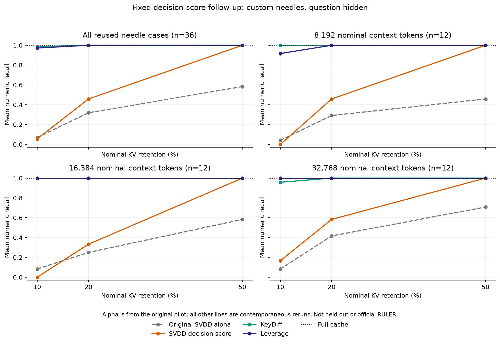
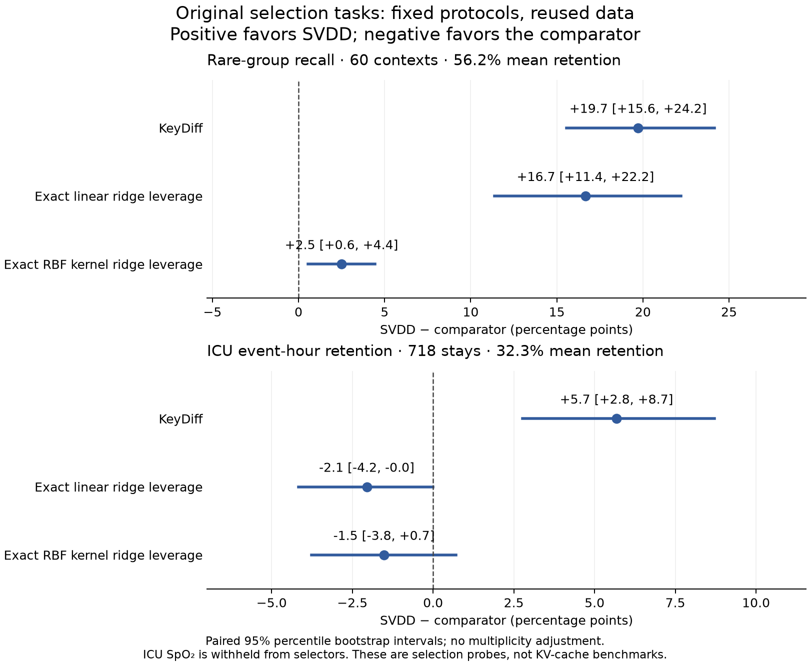

# Decision-score ranking and exact-leverage comparisons

Completed September 27, 2026 (Pacific time). Decision-score ranking
underperforms KeyDiff and leverage at tight KV budgets. The original selection
probes show a small
synthetic advantage over same-kernel leverage, but no advantage on ICU event
retention. These comparisons use fixed settings and the previously evaluated
protocols, with no parameter search.

## Decision-score ranking on needle retrieval

The follow-up reuses all 36 original needle contexts and generates **360 new
answers**, separate from the original 1,350. It changes only the SVDD ranking
rule, using signed squared feature-space distance beyond each fitted block's
radius. Scores are ranked globally across blocks within each head. The
original alpha ranker also ranked globally; neither used equal per-block quotas.
Both still fit separate 256-token blocks rather than one global SVDD problem.

| Selector | Recall at 10% KV | Recall at 20% KV | Recall at 50% KV |
|---|---:|---:|---:|
| Original SVDD alpha | 6.94% | 31.94% | 58.33% |
| SVDD decision score | 5.56% | 45.83% | 100.00% |
| KeyDiff | 98.61% | 100.00% | 100.00% |
| Leverage | 97.22% | 100.00% | 100.00% |

Full-cache recall is 100%. At the primary 20% budget, decision ranking gains
13.89 percentage points over alpha but still loses **54.17 points** to both
geometric baselines. It wins on zero cases, ties on ten, and loses on 26 against
each. At 50%, it only matches those cheaper baselines. Every repeated baseline
answer and score agrees exactly with the original run (252/252).

Decision scores retain boundary ties: 95.52% of fitted positive-dual coordinates
are free supports, whose decision
scores lie on the fitted boundary within solver precision. This observation
does not by itself explain a particular retrieval failure. All 297,024 fits
converged, and all 1,813,392 compared fit-metadata values matched the original
alpha fits. The change in ranking was tested without a bandwidth or solver sweep.

These are reused diagnostic cases, not held-out evidence. The KV leverage
baseline remains the original 48-dimensional pre-RoPE sketch; the exact
four-/five-dimensional leverage below belongs to a different experiment.
The [complete follow-up report](../results/decision_followup/summary/decision_followup_summary.md)
contains task/length breakdowns, paired intervals, cost caveats, and
[validation](../results/decision_followup/summary/validation.json).

## Original selection probes with stronger comparators

We reproduced the original generator, ICU preprocessing, seeds, support-count
budgets, readouts, and held-out SpO2 channel. All 60 synthetic trials completed;
718 of 1,465 ICU stays were event-positive and eligible, with the other 747
having no event. All 778 attempted SVDD solves returned optimal status.
The original published synthetic values reproduce to their reported precision,
and all stored original ICU comparison targets match exactly.

Added methods are KeyDiff, exact centered linear ridge leverage (4x4 or 5x5
solves), and exact uncentered kernel ridge leverage using **the same RBF Gram
as SVDD**. Both leverage controls use a fixed ridge of 0.01, with no parameter
search. Each compressed
method retains the complete SVDD support count for that context or stay.
Mean retention is 56.19% on synthetic and 32.26% on ICU. These are selection
probes with their original readouts, not language-model KV experiments.

| Selector | Synthetic rare-group recall, 60 contexts | ICU event-hour retention, 718 stays |
|---|---:|---:|
| SVDD support selection | 86.11% | 46.44% |
| Original mass/density proxy | 31.94% | 22.54% |
| KeyDiff | 66.39% | 40.76% |
| Exact linear ridge leverage | 69.44% | 48.49% |
| Exact same-RBF kernel ridge leverage | 83.61% | 47.95% |

Paired SVDD-minus-comparator differences, in percentage points, with 95%
percentile bootstrap intervals (10,000 paired resamples):

| Comparator | Synthetic difference [interval] | ICU difference [interval] |
|---|---:|---:|
| KeyDiff | +19.72 [15.56, 24.17] | +5.68 [2.76, 8.72] |
| Exact linear leverage | +16.67 [11.39, 22.22] | -2.05 [-4.17, -0.008] |
| Same-RBF kernel leverage | +2.50 [0.56, 4.44] | -1.52 [-3.77, 0.71] |

The strong synthetic advantage over linear methods mostly shrinks when the
comparator gets the same nonlinear kernel. A residual **2.5-point** advantage
remains under this fixed protocol. Both SVDD and kernel leverage retain all
rare groups and all groups on every synthetic trial, so the residual concerns
which retained keys influence the RBF readout; it does not show that only SVDD
preserves rare groups. Full-context rare-group recall is 72.22%, because repeated
groups can dominate that readout. Full context is an uncompressed reference,
not an accuracy upper bound.

On ICU, SVDD does not beat either leverage comparator. The secondary nearest-key
event-retrieval metric has the same ordering: SVDD 49.83%, linear leverage
51.92%, and kernel leverage 52.39%. This weakens the claim of a general
SVDD-specific redundancy advantage while preserving the small synthetic result.

Intervals are descriptive: these protocols and data were already inspected,
multiple contrasts are unadjusted, and ICU resampling assumes independent stays
without patient clustering. In particular, the tiny negative upper endpoint
for the linear ICU contrast does not support a robust significance claim.
Only aggregate clinical evidence is published; no patient-level records or
selected indices are included.

See the [frozen protocol](redundancy_protocol.md),
[all metrics and intervals](../results/redundancy/summary.csv),
[aggregate report](../results/redundancy/summary.md), and
[provenance](../results/redundancy/metadata.json). The
[public-artifact audit](../results/redundancy/validation.json) checks archived
hashes, synthetic selections/readouts/bootstrap intervals, original comparison
targets, and aggregate consistency. Clinical paired intervals cannot be
independently reconstructed from public aggregates; doing so requires the
credentialed cache and the frozen runner.

## Interpretation and validation

The tested selectors offer no demonstrated KV-compression advantage over the
geometric baselines. The small synthetic residual concerns the documented
RBF readout and does not establish an advantage for ordinary-softmax KV
compression. The coefficient-weighted deletion certificate does not transfer
to that readout.

The original evidence remains separate from both follow-ups. Current runtime
validation passes 102 tests, including real-model Metal checks; the two tests
requiring the optional CVXPY environment are skipped there and pass in the
separate 10-test CPU selection-probe suite. See
[runtime validation](../results/followup_validation.log) and
[CPU selection-probe validation](../results/redundancy_validation.log).
