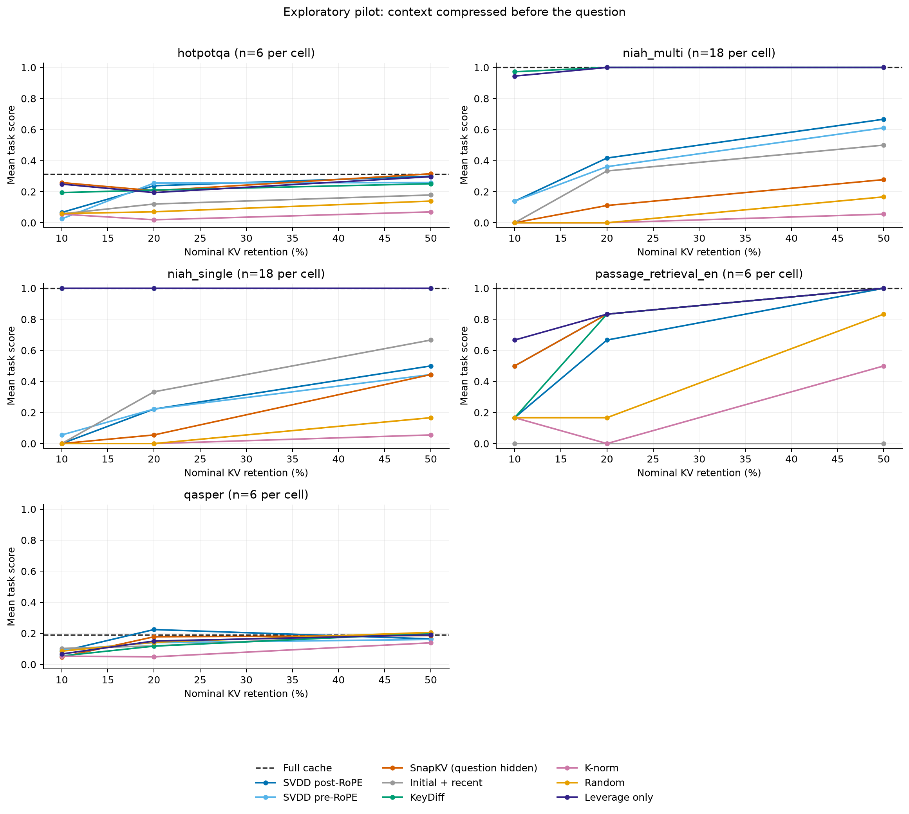

# KV-compression results and analysis

**Additional experiments, September 27, 2026:** decision-score
ranking reaches 45.83% needle recall at 20% KV, versus 100% for KeyDiff and
leverage. It only matches them at 50%. On the original selection probes,
SVDD exceeds same-RBF kernel leverage by 2.50 points on synthetic rare-group
recall, but has no advantage on ICU event retention. See [follow-up findings](followup_findings.md) for both
experiments, uncertainty, and interpretation. The original pilot below is
preserved as a separate experiment.

The main experiment, completed September 27, 2026, finds that the tested SVDD selector underperforms inexpensive geometric selectors on needle retrieval, gives mixed results on the small natural-task sample, and adds solver cost. This is a negative result for the specified blockwise ranker, not a proof that every possible SVDD formulation must fail.

The repository provides pinned inputs, complete answers, physical cache measurements, and reproducible analyses. The coefficient-weighted deletion certificate from prior work does not apply to selection followed by ordinary softmax.

## Evaluation scope

- Examined SV Attention and GemmaSV v4 and their reference implementations. See the [prior-work analysis](prior_work_status.md).
- Reviewed 30 primary-source bibliography entries, emphasizing close geometric selectors, query visibility, kernel coresets, standard cache baselines, and evaluation. See the [literature review](literature_review.md) and [bibliography](../references.bib).
- Built a standalone Apple/MLX pilot around **Qwen2.5-7B-Instruct, four-bit weights and 16-bit KV**, with pinned model/data revisions and archived execution source.
- Generated **1,350 answers: 54 contexts × 25 arms**. The arms are full cache plus eight selectors at 10%, 20%, and 50% retention. There are 36 custom single/two-needle contexts at nominal 8k, 16k, and 32k windows, plus six untruncated examples each from LongBench HotpotQA, Qasper, and passage retrieval.
- Physically compacted K/V tensors per head and used ordinary native softmax afterward. Every method compresses before the question arrives. Pre-RoPE SVDD tests whether positional rotation explains the post-RoPE variant's weakness.

The detailed [protocol](pilot_protocol.md), [method definitions](selector_method.md), and [data audit](data_audit.md) specify the boundaries. Custom NIAH is not official RULER; these adapted LongBench subsets are not leaderboard results.

## Needle retrieval

Mean per-case numeric recall over all 36 custom needle contexts, percent. Full cache scores **100%**. A two-needle case can receive partial credit, so these are recall scores rather than exact-answer success rates.

| Selector | 10% KV retained | 20% KV retained | 50% KV retained |
|---|---:|---:|---:|
| SVDD, post-RoPE | 6.9 | 31.9 | 58.3 |
| SVDD, pre-RoPE | 9.7 | 29.2 | 52.8 |
| KeyDiff score | **98.6** | **100.0** | **100.0** |
| Leverage score | 97.2 | **100.0** | **100.0** |
| SnapKV-style, question hidden | 0.0 | 8.3 | 36.1 |
| Initial + recent tokens | 0.0 | 33.3 | 58.3 |
| K-norm | 0.0 | 0.0 | 5.6 |
| Random | 0.0 | 0.0 | 16.7 |

At 20% retention, both geometric baselines recover every requested number on every case. Post-RoPE SVDD loses 68.1 percentage points of mean recall to them; the pre-RoPE variant loses 70.8 points. The gap is present across context lengths; it is not explained by a failing full-cache model. SVDD exceeds the restricted SnapKV comparator, but the closest query-free geometric baselines perform substantially better.

The repeated scientific prose and conspicuous inserted numbers make this a favorable setting for some outlier selectors. This limits generalization of KeyDiff's near-perfect result and of the observed gap to SVDD.

The [complete quality tables](../results/pilot/summary/results_summary.md), [length breakdown](../results/pilot/summary/niah_by_length.png), [paired differences and exploratory intervals](../results/pilot/summary/paired_deltas.csv), and [raw answers](../results/pilot/predictions.jsonl) preserve the full results.

## Natural tasks: mixed evidence, no demonstrated broad advantage

Mean score at **20% retained KV**, with six examples per task. QA columns are normalized token F1; passage retrieval is the paragraph-number retrieval score. Values use a 0–1 scale.

| Method | HotpotQA F1 | Qasper F1 | Passage retrieval |
|---|---:|---:|---:|
| Full cache | 0.313 | 0.190 | 1.000 |
| SVDD, post-RoPE | 0.238 | **0.224** | 0.667 |
| SVDD, pre-RoPE | **0.255** | 0.140 | 0.833 |
| KeyDiff | 0.211 | 0.118 | 0.833 |
| Leverage only | 0.194 | 0.151 | 0.833 |
| SnapKV-style, question hidden | 0.206 | 0.178 | 0.833 |
| Initial + recent | 0.121 | 0.119 | 0.000 |
| K-norm | 0.019 | 0.049 | 0.000 |
| Random | 0.071 | 0.143 | 0.167 |

Bold identifies the best compressed QA entry in this table. SVDD has some favorable QA numbers. However, six examples and low full-cache F1 provide weak evidence of a real advantage. F1 is affected by verbosity and answer wording as well as correctness. Four of the twelve full-cache QA generations reach the 128-token cap. For example, an otherwise correct number embedded in a long explanation can receive low F1. The unchanged prompts and raw outputs are available for inspection; these results were not repaired by answer-aware prompt tuning.

Passage retrieval is easier to interpret because full cache gets all six cases right. Post-RoPE SVDD gets four right at 20%, while pre-RoPE SVDD, KeyDiff, leverage, and SnapKV-style each get five. At 50%, both SVDD variants and those three baselines reach six of six. This is insufficient evidence to choose SVDD over the cheaper alternatives.

## Actual memory and latency

The separate systems suite measures one 32,512-token prefix on the Apple M3 Ultra at 20% retention, with two fresh-process repetitions per method and 32 fixed decode forwards. All arms use a validated reserved append-buffer backend. These are medians; the [complete systems table](../results/systems_summary/systems_summary.md) preserves both runs and their observed ranges.

| Method | Prefix KV MiB | Selection + compaction, s | Decode forwards/s | Prefill + selection + suffix + decode, s |
|---|---:|---:|---:|---:|
| Full cache | 1,778.00 | 0.000 | 71.13 | 30.14 |
| SVDD, post-RoPE | 355.58 | 9.898 | 101.82 | 39.86 |
| SVDD, pre-RoPE | 355.58 | 10.298 | 101.24 | 40.14 |
| KeyDiff | 355.58 | 1.329 | 102.11 | 31.29 |
| Leverage only | 355.58 | 1.932 | 101.26 | 31.87 |
| SnapKV-style | 355.58 | 0.418 | 101.44 | 30.33 |
| Initial + recent | 355.58 | 0.033 | 101.50 | 29.90 |

Compaction works: retained prefix KV payload falls by 80%, and post-release active MLX memory, including weights, falls from **5.73 to 4.34 GiB**, a **24.2%** reduction. The allocated compact KV capacity is 358.64 MiB, including space for the suffix and fixed decode steps. These reductions come from retaining fewer rows and are shared by every method at the same budget.

Decode alone is about 43% faster for post-RoPE SVDD than full cache. However, selection takes **9.90 seconds versus 1.33 for KeyDiff**, making the full measured 32-step workload **32.2% slower than full cache**. The cheaper geometric selectors obtain the same compact-cache decode benefit with much less construction work and much better needle quality in this pilot.

Peak active MLX memory **rises from 6.11 to about 6.43 GiB** because this prototype builds the full prefix and temporarily overlaps old and compacted storage. It therefore demonstrates reduced steady decode storage, not reduced peak prefill memory. Process RSS is recorded separately and must not be added to MLX active bytes or treated as a complete account of Metal allocations. Two repetitions on one context are a local systems check, not a broad latency benchmark. Fixed decode continues after EOS; model loading and warmup are excluded. The shared quality-harness timings are not used for these speed comparisons.

## Validation and limitations

The [artifact validation](../results/pilot/validation.json) passes all 54 cases and 1,350 expected answers, recomputes every score, verifies token/source hashes and exact cache byte counts, and checks support accounting. Across the final run, **399,840 block solves per SVDD variant converge, with zero reported convergence failures**. On a 40-key synthetic fixture, an independent constrained-QP check agrees with the deployed solver's objective to approximately `1.2e-10` at the pilot's `nu=0.05`. Runtime checks cover native/full-cache logit equality, per-head gathers, causal masks, absolute RoPE offsets, and an independent SnapKV score reference. See the [selector audit](selector_audit.md).

The [final test run](../results/final_validation.log) passes **all 79 tests**, including the opt-in real-model Metal tests and equivalence of the reserved systems cache with the quality cache. It ran after the isolated timing suite finished.

The mean raw support fractions are **16.0% post-RoPE and 14.9% pre-RoPE**, despite `nu=0.05`. Thus `nu` is demonstrably not the requested cache fraction. At 10% the method discards fitted supports; at 50% it fills many slots with zero-score positions. Those ties prefer earlier tokens. Separate 256-token objectives also do not provide globally comparable notions of token importance. These are limitations of the specified algorithm, not solver failures.

The final diagnostics sharpen this distinction: at 10% retention, 37.9%/33.4% of fitted supports are discarded and fewer than 2% of retained slots have zero scores. Zero filling therefore cannot explain the tight-budget failure by itself. At 50%, 68.4%/70.5% of retained slots have zero scores, overwhelmingly from the chronological fill rule; those results cannot be credited solely to support selection.

The initial partial run had a missing separator before synthetic questions. It was stopped, preserved under `results/pre_separator_check`, and excluded. The corrected run restarts every case and arm; all tables in this report use only `results/pilot`. No scores from the exploratory smoke run or excluded run enter these results.

This pilot uses one older, weight-quantized model; custom repetitive needles; small adapted LongBench subsets; one SVDD bandwidth/block/normalization configuration; and post-prefill compression. It does not test bounded-memory online prefill, official RULER, official CUDA baseline implementations, H2O, PyramidKV, TOVA, full Compactor, or KV quantization. The `streaming` baseline is sink/recent selection without StreamingLLM's positional remapping. SnapKV sees context-tail queries with the downstream question hidden. None of the negative baseline results should be presented as a general evaluation of those published systems.

## Theoretical scope and related methods

**The certificate does not transfer.** The earlier theorem concerns a readout whose numerator and denominator both multiply each contribution by its SV coefficient. Ordinary softmax assigns positive weight to every finite unmasked logit. A zero SV coefficient therefore does not imply zero softmax contribution. Executable counterexamples in this workspace show immediate output change after deleting a zero-coefficient key. “Exact at eviction” is unavailable for this selection-only proposal without additional assumptions and a different proof.

**Query-free geometric selection is already occupied.** [KeyDiff](https://arxiv.org/abs/2504.15364v4) and [Compactor](https://arxiv.org/abs/2507.08143v2) are central prior work, with K-norm and several later methods nearby. The targeted review did not find another explicit SVDD-for-KV-eviction paper, but that is not a novelty certificate. A different optimization objective would need a quality, cost, or carefully scoped theoretical advantage over these rivals.

## Interpretation

The tested SVDD rankers offer no demonstrated quality–cost advantage over
KeyDiff and leverage in this setting. The [decision-score and redundancy
comparisons](followup_findings.md) preserve this conclusion while identifying
a small synthetic advantage over same-kernel leverage. These observations are
specific to the documented models, protocols, and selectors. The original
coefficient-weighted removal guarantee supplies no exactness claim for the
ordinary-softmax readout used here.
